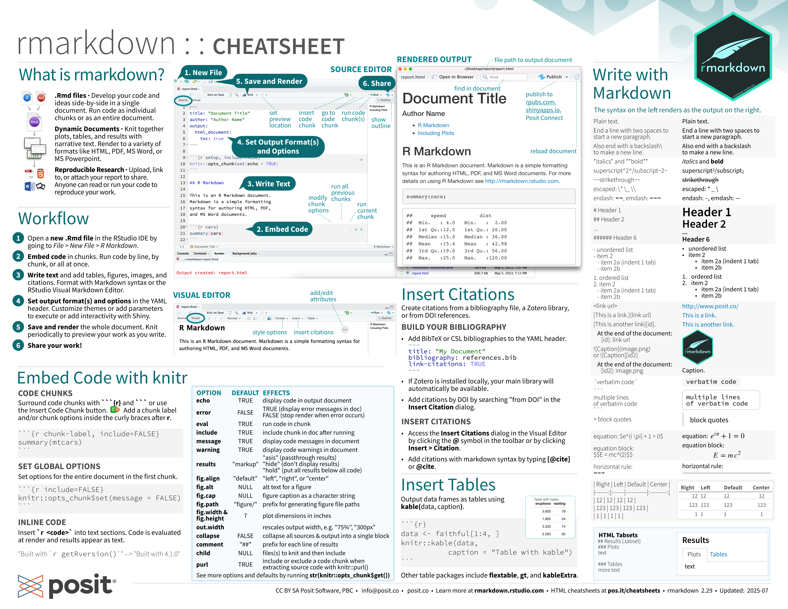
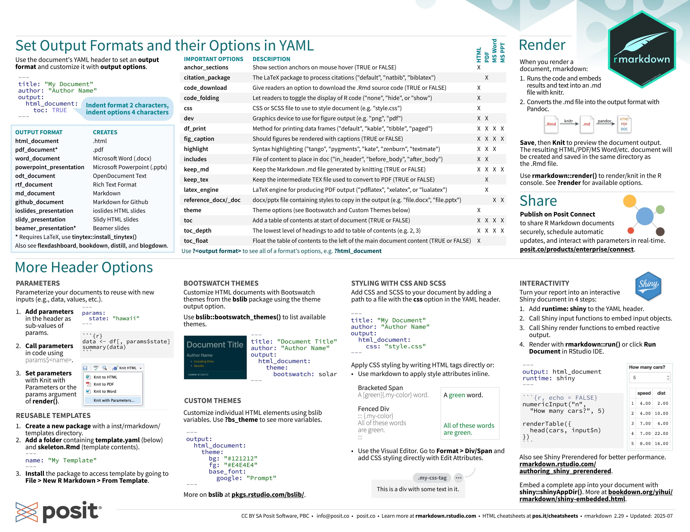

# Markdown

[Quarto markdown basics page](https://quarto.org/docs/authoring/markdown-basics.html)

{style="width:100%"}

{style="width:100%"}

Source: [https://opensource.posit.co/resources/cheatsheets/rmarkdown/](https://opensource.posit.co/resources/cheatsheets/rmarkdown/)